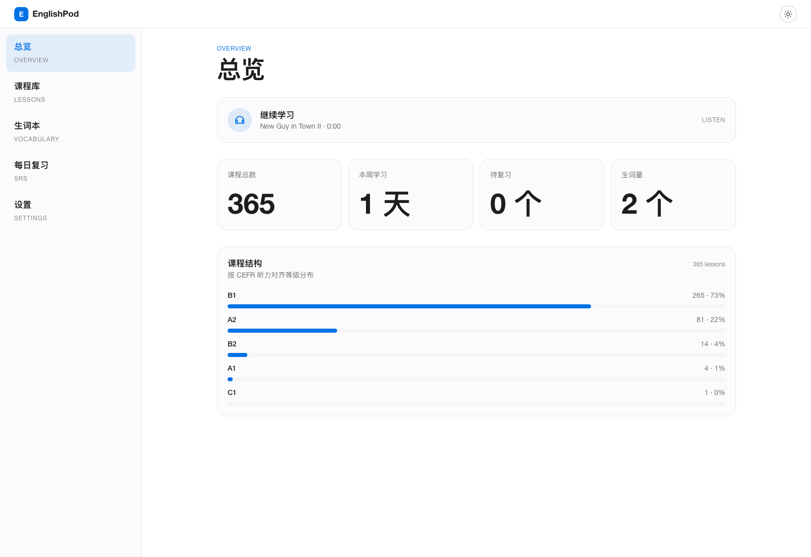
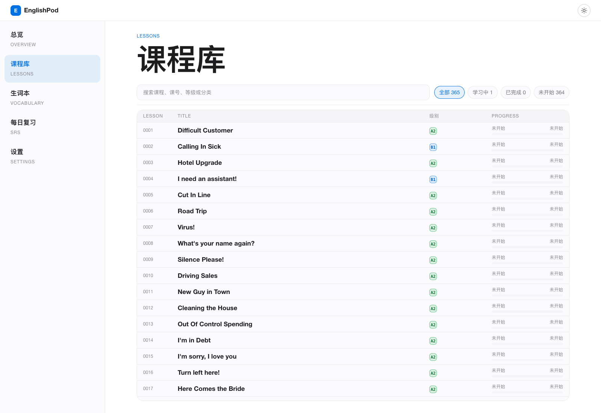
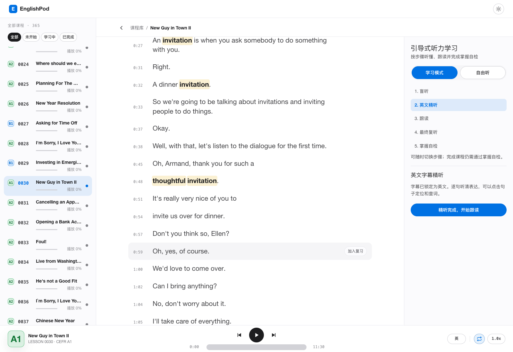
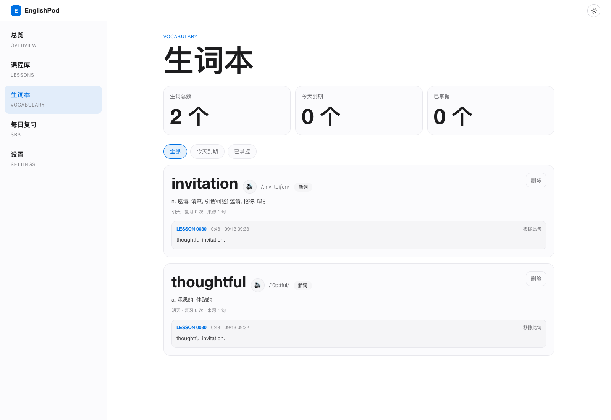

# EnglishPod · 365 节英语听力学习

基于 365 节 EnglishPod 课程的个人英语学习项目，支持本地运行：听原声、看字幕、查单词、收藏生词与句子，再通过间隔复习巩固。当前版本包含课程库、五步引导学习、CEFR 难度估算、单词发音和按课程清除学习记忆等功能。

EnglishPod is a self-hosted learning app with 365 lessons, guided listening, bilingual subtitles, dictionary lookup, word pronunciation, vocabulary collections, and spaced review. Learning data is stored in your browser.

本文按 2026-09-13 的仓库代码与资源核对。当前仓库为 [EnglishPodStudy-Complete](https://github.com/457975901qq-alt/EnglishPodStudy-Complete)，基于 [leter/englishPodStudy](https://github.com/leter/englishPodStudy) 扩展维护。

## 快速开始

准备 Git、Node.js **22.18 或更高的 22.x 版本，或 Node.js 24.x**，以及随 Node.js 安装的 npm。仓库测试直接执行部分 TypeScript 文件，使用上述版本可同时运行开发、构建与自检；不要仅按旧启动脚本提示安装任意 Node.js 20。

```bash
git clone --depth 1 https://github.com/457975901qq-alt/EnglishPodStudy-Complete.git
cd EnglishPodStudy-Complete
npm ci
npm run serve
```

打开 [http://localhost:4173](http://localhost:4173)。`serve` 会构建前端、准备词典，再由一个 Node.js 服务提供网页和 API。首次安装依赖需要联网；课程资源已包含在仓库中，下载体积较大。服务需要保持运行，在启动终端按 `Ctrl+C` 停止。

以后启动已构建版本：

```bash
npm start
```

更新代码后重新安装依赖并构建：

```bash
git pull --ff-only
npm ci
npm run serve
```

更新前先保存自己的源码修改。日常使用建议固定同一个浏览器和地址：`localhost`、`127.0.0.1` 或不同端口会使用不同的浏览器存储，学习记录不会自动互通。

## 界面截图 / Screenshots

以下截图于 2026-09-13 使用当前版本实际运行界面拍摄，分辨率为 1600 × 1100。学习进度与生词为独立演示会话中的示例数据。

### 总览 / Dashboard



### 课程库 / Course Library



### 课程详情 / Lesson Detail



### 生词本 / Vocabulary



## 学习功能

### 总览与课程库

- 总览显示课程总数、本周学习天数、到期复习数量、生词量，以及 CEFR 等级分布；“继续学习”可返回最近课程的播放位置。
- 课程库支持按标题、课号、等级或分类搜索，以及“全部 / 学习中 / 已完成 / 未开始”筛选。
- 等级列显示简洁的 `A1`、`A2`、`B1` 等徽标。播放百分比与课程完成状态分开记录，听到结尾不等于已经完成学习。
- 课程表格内部滚动。向下浏览时上方标题、搜索和筛选区域收起，返回列表顶部后恢复，为课程列表留出更多空间。
- 进入课程后，左侧列表自动定位到当前课程，并保留选中状态与播放进度。

### 五步引导学习

课程页默认进入“学习模式”。未完成的课程会恢复已保存的步骤，没有步骤记录时从“盲听”开始。五个步骤可以直接点击、自由切换。

| 步骤 | 字幕状态 | 使用方式 |
| --- | --- | --- |
| 1. 盲听 | 关闭 | 先听一遍，选择首遍理解率 |
| 2. 英文精听 | 英文 | 逐句定位、听清表达、点击查词 |
| 3. 跟读 | 英文 | 选择句子模仿语音语调，自行确认跟读情况 |
| 4. 最终复听 | 关闭 | 再次无字幕听课，然后进入自检 |
| 5. 掌握自检 | 关闭 | 确认四项学习目标后标记本课已学习 |

四项自检为：无字幕理解至少 80%、掌握 3–5 个表达、跟读至少 3 句、完成口头复述。全部勾选后才能标记完成；直接切换步骤不会自动完成课程。这些是学习者自评，当前没有录音识别或自动跟读评分。

已完成的课程显示“本课已学习”，不再显示未完成课程的步骤面板。若要从头学习，可在设置中清除该课记忆。

切换到“自由听”后，可自行选择中英双语、仅英文、仅中文或无字幕。引导学习中的字幕则由当前步骤控制；自由听未保存字幕偏好时使用双语。

### 播放与字幕操作

- 固定底部播放器支持暂停 / 继续、上一课 / 下一课、进度拖动与播放位置记忆。
- 默认循环播放当前课程，也可切换为顺序或随机播放。
- 支持 `0.75×`、`1.0×`、`1.25×`、`1.5×`、`2.0×` 播放速度。
- 在课程页按空格键暂停或继续；焦点在按钮、输入框等控件时，保留控件自身的键盘行为。
- 字幕随播放进度高亮并滚动；点击句子或时间点可定位播放，点击英文单词可查询释义。

### 查词、发音与生词高亮

单词弹窗提供音标、中文释义和可用的词性信息。查询结合原词、词形映射、常见变形规则与缩写处理，支持如 `goes`、`weeks`、`they've` 等形式。词形匹配不等于整句语境翻译，多义词仍需结合上下文判断。

点击单词时会尝试自动播放**所点击单词**的发音；弹窗和生词本中也有手动发音按钮。发音来自后端代理的有道单词音频接口，需要联网，不需要安装 EasyDict。若浏览器阻止自动播放，可点击发音按钮重播。

收藏时记录单词、释义、来源课程、原句和音频时间段。同一单词可以保留多个课程上下文；在当前课程中收藏过的词会以淡黄色背景、深色文字高亮。生词本支持查看全部、今天到期或已掌握的词，返回来源课程，移除某条上下文或删除词条。

本地词典源为 [resource/dict/ecdict.mini.csv](resource/dict/ecdict.mini.csv)，查询索引由启动脚本自动生成。未找到的词会提示未收录；字典释义并非模型实时生成。

### 句子收藏与每日复习

字幕旁的“加入复习”可收藏原句。每日复习将到期生词和句子交错安排，每组最多 10 项；新收藏内容默认约 24 小时后到期。

- 生词卡片：听来源音频片段，结合高亮单词回忆含义，再显示答案。
- 句子卡片：先隐藏字幕听原句，再显示答案核对。
- 生词自评选项为“完全没懂 / 有点印象 / 听懂了 / 太简单”；句子为“没听出来 / 听出一部分 / 听懂了 / 能跟读”。
- 系统按自评结果调整下次复习时间。音频从保存的片段起点开始，并在片段终点暂停；显示仍使用原课程音频的时间轴。
- 复习展示会合并相邻、内容相同的英文行，减少重复显示。

复习片段依赖收藏时保存的字幕时间点。之后即使更新课程 SRT，旧收藏的原句与时间点也不会自动重建；发现旧卡片错位时，可移除对应上下文或复习句，再从更新后的课程重新收藏。

### 设置与学习记忆

设置支持明暗主题切换，以及两种需要确认的清除操作：

| 操作 | 删除范围 | 保留内容 |
| --- | --- | --- |
| 清除单课学习记忆 | 所选课的播放进度、学习步骤、完成记录、生词上下文与复习句 | 其他课程；仍有其他课程上下文的生词；主题和字幕偏好 |
| 清空学习记忆 | 所有课程进度、生词和复习内容 | 主题和字幕偏好 |

单课清除先选择课程，再确认清除；全量清除需要输入界面要求的确认文字。清除后没有内置撤销功能。

学习数据保存在浏览器 `localStorage` 中，当前没有账号登录、跨设备同步或内置导入导出。更新项目文件不会主动清空这些记录，但清理站点数据或更换浏览器、访问地址后，原记录不会自动出现。

## CEFR 难度说明

全部 365 节课程使用同一套规则生成 CEFR 对齐估算。当前分布为 `A1：4`、`A2：81`、`B1：265`、`B2：14`、`C1：1`，详见 [cefr-assessment.json](resource/cefr-assessment.json)。

| 指标 | 权重 | 当前实现依据 |
| --- | --- | --- |
| 词汇难度 | 45% | ECDICT 的 Oxford 标记和词频数据 |
| 句法复杂度 | 25% | 字幕语块平均词数、从属与连接标记密度 |
| 语速 | 20% | 字幕词数与最后时间戳估算的每分钟词数 |
| 信息密度 | 10% | 内容词比例与词汇类型比例 |

等级、分数、置信度、规则版本和指标保存在 JSON 中，由 API 合并到课程数据。课程库以等级徽标展示，分数和置信度并非当前页面的常驻展示项。原始 EnglishPod B–F 级别仍保留用于追溯。

这是基于文本与字幕时间轴的项目自定义估算，**不是官方 CEFR 认证，也不是严格的听力测评**。它不直接分析音频中的口音、背景噪声或真实理解表现；字幕修改也可能改变估算结果。JSON 内保留了规则所参考的 CEFR 资料地址。

## 课程资源与字幕现状

当前 `0001`—`0365` 每课都包含以下 10 类文件，共 365 套；文件存在不代表内容已全部人工校对。

| 文件 | 用途 |
| --- | --- |
| `lesson.mp3` | 课程页与复习页使用的完整课程音频 |
| `dialog.mp3` | 对话音频资源 |
| `review.mp3` | 复习音频资源，与应用每日复习队列不是同一功能 |
| `subtitle.srt` | 英文字幕 |
| `subtitle.zh.srt` | 中文字幕 |
| `subtitle.bilingual.srt` | 中英双语字幕 |
| `transcript.txt`、`transcript.zh.txt` | 英文与中文文本 |
| `worksheet.pdf` | 课程练习资料 |
| `host.pdf` | 主持人脚本或标注为 `GENERATED SUPPLEMENT` 的补充稿 |

`host.pdf` 中既有原版资料，也有由本地转录稿生成的补充版。补充版不能视为独立的音频校对依据，后续 SRT 修正也不会自动重新生成 PDF。

已修复部分重复、乱码、错误文本与时间段，并提供全课字幕自检。当前自检覆盖三种字幕的条数和时间戳一致性、已知乱码、连续重复及部分修复回归，**不证明每一句与音频完全一致，也不证明翻译全部正确**。本地 Whisper 曾用于部分片段复核，365 节课程的全量语音对齐尚未完成。

项目正常运行不依赖 Whisper、大模型文件或 OpenAI API Key，仓库未提供自动全课模型对齐流程。已有修复脚本针对特定历史数据，不应当作通用批量校正工具反复运行。

## 启动方式

### 本机脚本

macOS / Linux：

```bash
bash start.sh          # 检测依赖、构建前端并启动单端口服务
bash start.sh --dev    # API + Vite 开发模式
PORT=8080 bash start.sh
```

Windows PowerShell：

```powershell
./start.ps1
./start.ps1 -Dev
./start.ps1 -Port 8080
```

脚本只在 `node_modules` 不存在时安装依赖；更新依赖后请主动执行 `npm ci`。脚本不是系统安装器，仓库没有通用的桌面应用或登录自启安装流程。可收藏本地地址方便打开；服务仍需先启动，单独打开书签不会启动后端。

### 开发模式

```bash
npm run dev
```

API 默认运行在 `http://localhost:4173`，Vite 通常为 `http://localhost:5173`，以终端输出为准。开发时打开 Vite 地址，前端通过 `/api` 代理访问后端。

也可在两个终端分别执行 `npm run dev:api` 和 `npm run dev:web`。开发代理目标写在 [apps/web/vite.config.ts](apps/web/vite.config.ts) 中，修改 API 端口后需要同时修改代理目标。

### Docker

```bash
docker compose up -d --build
docker compose logs -f
```

打开 `http://localhost:4173`。停止容器使用 `docker compose down`。修改宿主机端口示例：

```bash
PORT=8080 docker compose up -d --build
```

Compose 默认仅映射到宿主机 `127.0.0.1`。镜像构建前端，运行时以非 root 用户提供网页与 API；`resource` 从宿主机只读挂载，生成的词典索引写入容器 `/app/generated-dict`。构建镜像本身不会下载课程资源。

### 环境变量与部署

| 变量 | 默认值 | 作用 |
| --- | --- | --- |
| `HOST` | `127.0.0.1` | 后端监听地址；Docker 内为 `0.0.0.0` |
| `PORT` | `4173` | 后端端口 |
| `WEB_DIST_DIR` | `apps/web/dist` | 后端托管的前端构建目录 |
| `ENGLISHPOD_DICT_DIR` | `resource/dict` | 词典索引输出及查询目录 |
| `ENGLISHPOD_DICT_SOURCE` | `resource/dict/ecdict.mini.csv` | 自动构建时读取的 CSV 源 |

这些是进程环境变量，项目没有自动读取 `.env` 的加载器。macOS / Linux 可在命令前设置：

```bash
PORT=8080 npm start
```

PowerShell：

```powershell
$env:PORT = '8080'
npm start
```

生产使用执行 `npm ci` 和 `npm run build:web` 后运行 `npm start` 即可，无需再单独运行前端预览服务。若通过 Nginx / Caddy 部署，可将网页和 `/api` 一起反向代理到该 Node.js 服务，并配置 HTTPS。

`HOST=0.0.0.0` 可用于局域网访问，但应用没有访问认证；若部署到公共网络，需要在外层配置访问控制。`npm run preview -w apps/web` 仅供检查前端构建产物，不作为本项目的完整日常启动方式。

## 开发与维护

### 技术栈与目录

前端使用 React 19、TypeScript 6、Vite 8、React Router 7 和 Tailwind CSS 4；后端为 Node.js 原生 HTTP 服务；依赖由 npm workspaces 管理。具体锁定版本以 `package-lock.json` 为准。

```text
.
├── apps/
│   ├── api/src/                 # 课程、字幕、文件、词典与发音 API
│   └── web/src/                 # 页面、播放器、字幕与本地学习数据
├── resource/
│   ├── 0001/ … 0365/            # 每课音频、字幕、文本与 PDF
│   ├── course-list.json         # 课程目录与原始级别
│   ├── cefr-assessment.json     # CEFR 估算结果与规则说明
│   ├── lesson-titles.json       # 标题补充记录
│   ├── lesson-levels.json       # 原始级别补充记录
│   └── dict/ecdict.mini.csv     # 词典源数据
├── screenshot/                 # README 实际界面截图
├── tools/                      # 词典构建、CEFR 估算、自检与历史修复
├── start.sh / start.ps1         # 本机启动脚本
├── Dockerfile / docker-compose.yml
├── PRD.md / STUDY_PLAN.md       # 产品规划与学习参考
└── package.json                # 项目命令入口
```

### 词典与 CEFR 数据更新

`npm start`、`npm run dev` 和容器启动会检查词典索引；索引不存在或早于源 CSV 时自动重建。生成的 `lookup.json`、`lemmas.json` 不纳入 Git。

```bash
node tools/ensure-dict.mjs     # 按需构建
node tools/build-dict.mjs      # 手动重建默认词典
npm run assess:cefr           # 更新 CEFR 结果文件
```

自定义词典路径示例（macOS / Linux）：

```bash
ENGLISHPOD_DICT_SOURCE=/path/to/ecdict.csv ENGLISHPOD_DICT_DIR=/path/to/generated-dict npm start
```

独立构建脚本也支持显式输入与输出：

```bash
node tools/build-dict.mjs /path/to/ecdict.csv /path/to/generated-dict
```

CEFR 脚本使用仓库内默认词典与字幕，不随 API 的自定义词典路径自动切换。修改字幕或默认词典后，可重建索引、重新估算并检查结果差异；历史估算不会随网页启动自动刷新。

### 检查命令

```bash
npm test                   # 词典、CEFR、API 与网页 self-check
npm run lint:web           # 前端 ESLint
npm run build:web          # TypeScript 检查与生产构建
git diff --check           # 检查补丁格式
```

按需单独运行：

```bash
npm run test:dict
npm run test:cefr
npm run test:api
npm run test:web
node tools/subtitle-integrity.self-check.mjs
```

这些是数据、逻辑与构建检查，不能替代浏览器交互验证或完整音频人工校听。

### API

| GET 接口 | 用途 |
| --- | --- |
| `/api/health` | 服务健康检查 |
| `/api/courses` | 含 CEFR 字段的课程目录 |
| `/api/courses/:lessonId` | 单节课程信息 |
| `/api/courses/:lessonId/subtitles?mode=en` | 解析字幕；支持 `en`、`zh`、`bilingual`、`off` |
| `/api/resources/:lessonId/:fileName` | 允许列表内的课程资源文件 |
| `/api/dict/:word` | 本地词典查询 |
| `/api/dict-audio/:word` | 代理当前单词的有道发音 |

课号为四位数字。资源接口允许三类 MP3、三类 SRT、`transcript.txt`、`worksheet.pdf` 和 `host.pdf`，当前不对外提供 `transcript.zh.txt`。发音接口仅接受单词、连字符词或缩写，不接受句子。`mode=off` 仍返回双语字幕数据，由前端隐藏显示。

## 常见问题与当前限制

- **首次打开没有字幕**：新课程默认盲听，切到“英文精听”，或在“自由听”中选择字幕。
- **听完了仍显示学习中**：播放进度与完成记录独立，需要完成掌握自检才能标记已学习。
- **收藏后每日复习为空**：新内容默认约 24 小时后到期；也可先在生词本查看。
- **单词没有声音**：确认网络可访问有道音频，并尝试手动发音按钮；本地课程播放与本地查词不需要该网络请求。
- **更新后仍是旧界面**：重新运行 `npm run serve` 并刷新网页，确认打开的是本次服务的地址。
- **学习记录看起来丢失**：先核对浏览器、域名和端口是否与原来一致。服务器没有一份可自动恢复的学习数据副本。
- **端口被占用**：可能已有服务在运行；检查现有页面，或用其他端口启动。不同端口的学习记录独立。
- **模型与高级功能**：当前没有内置 AI 语法讲解、自动跟读评分、全课语音对齐、账号同步或 PDF 内嵌阅读。规划文档中的功能不一定已经实现。

## 来源与许可

项目代码保留原仓库的 [MIT License](LICENSE)。词典整理自 [ECDICT](https://github.com/skywind3000/ECDICT)；课程补充资源来源包括 [Bex0-0/EnglishPod365](https://github.com/Bex0-0/EnglishPod365) 归档。课程音频、PDF 和其他第三方资料的权利不因代码使用 MIT 许可而改变，使用或分发时应核对相应来源的授权。
